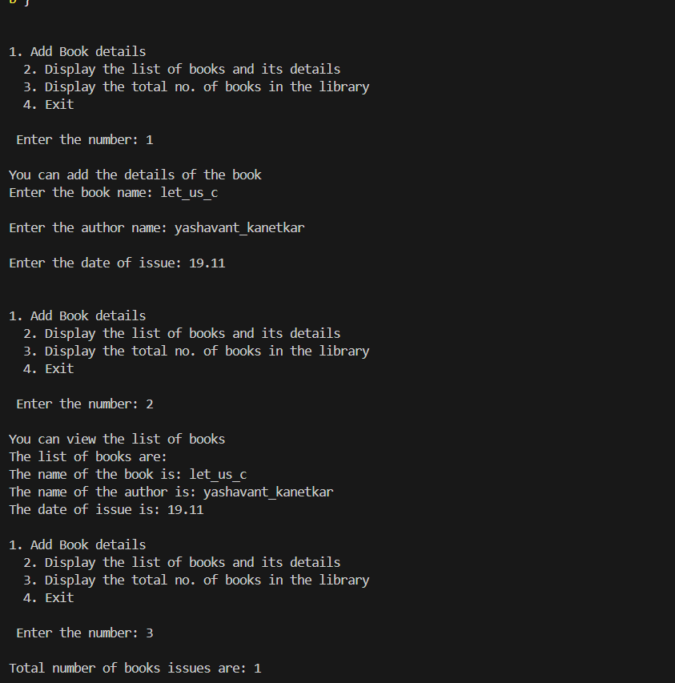
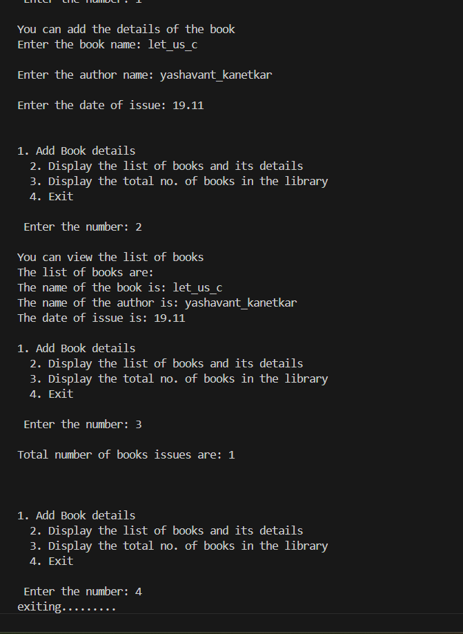

..............................welcome to library management system .................................

This code is a C program for managing a simple library system.

This code is structured to keep track of books in a basic library setup,
allowing for simple CRUD (Create, Read, Update, Delete) operations on books.

